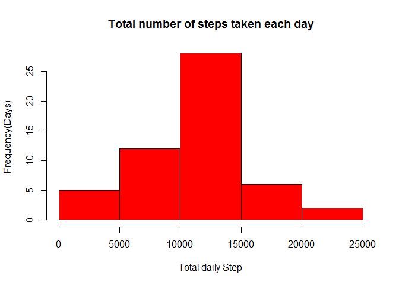
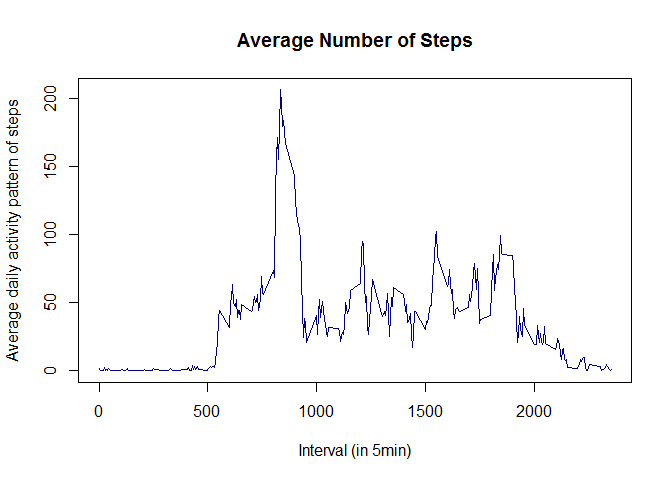
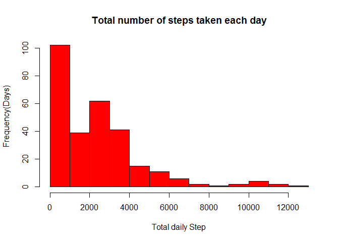
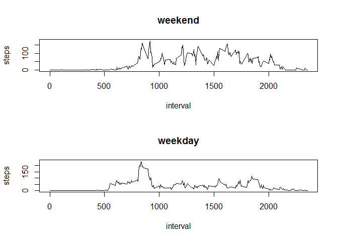

# Reproducible Research: Peer Assessment 1


# Data Reading and Processing

```r
fileUrl <- "https://d396qusza40orc.cloudfront.net/repdata%2Fdata%2Factivity.zip"
download.file(fileUrl, destfile="Fdata.zip")
unzip(zipfile="Fdata.zip")
FData <- read.csv("activity.csv", header=TRUE)
(echo = TRUE)
```

```
## [1] TRUE
```

#Histogram of the total number of steps taken each day

```r
dailysteps <- aggregate(steps~date,FData,sum)
hist(dailysteps$steps, main="Total number of steps taken each day",
 xlab="Total daily Step", ylab="Frequency(Days)", col="red")
```

<!-- -->

```r
(echo = TRUE)
```

```
## [1] TRUE
```

#Mean and median number of steps taken each day

```r
Mean <- mean(dailysteps$steps)
Median <- median(dailysteps$steps)
Mean
```

```
## [1] 10766.19
```

```r
Median
```

```
## [1] 10765
```

```r
(echo = TRUE)
```

```
## [1] TRUE
```


# Time series plot of the average number of steps taken

```r
StepsInterval <- aggregate(steps ~ interval, data=FData, FUN=mean)
plot(StepsInterval, type="l",xlab="Interval (in 5min)", ylab="Average daily activity pattern of steps",  main="Average Number of Steps", col="navy")
```

<!-- -->

```r
(echo = TRUE)
```

```
## [1] TRUE
```

#The 5-minute interval that, on average, contains the maximum number of steps

```r
StepsInterval$interval[which.max(StepsInterval$steps)]
```

```
## [1] 835
```

```r
(echo = TRUE)
```

```
## [1] TRUE
```

#Code to describe and show a strategy for imputing missing data

```r
sum(is.na(FData))
```

```
## [1] 2304
```

```r
FDataMerged=merge(FData, StepsInterval, by="interval")
FDataMerged$steps.x[is.na(FDataMerged$steps.x)]=FDataMerged$steps.y[is.na(FDataMerged$steps.x)]
(echo = TRUE)
```

```
## [1] TRUE
```

#Histogram of the total number of steps taken each day after missing values are imputed

```r
FDataMerged <- aggregate(steps.x~interval, FDataMerged, sum)
hist(FDataMerged$steps.x, xlab="Total daily Step", ylab="Frequency(Days)",main="Total number of steps taken each day", col="red")
```

<!-- -->

```r
(echo = TRUE)
```

```
## [1] TRUE
```

#Mean and median number of steps taken each day after imputing missing values

```r
Mean1 <- mean(FDataMerged$steps)
Median1 <- median(FDataMerged$steps)
Mean1
```

```
## [1] 2280.339
```

```r
Median1
```

```
## [1] 2080.906
```

```r
(echo = TRUE)
```

```
## [1] TRUE
```
#Panel plot comparing the average number of steps taken per 5-minute interval across weekdays and weekends

```r
daytype <- function(date) {
    if (weekdays(as.Date(date)) %in% c("Saturday", "Sunday")) {
        "weekend"
    } else {
        "weekday"
    }
}
FData$daytype <- as.factor(sapply(FData$date, daytype))

par(mfrow=c(2,1))
for (type in c("weekend", "weekday")) {
    steps.type <- aggregate(steps ~ interval,
                            data=FData,
                            subset=FData$daytype==type,
                            FUN=mean)
    plot(steps.type, type="l", main=type)
}
```

<!-- -->

```r
(echo = TRUE)
```

```
## [1] TRUE
```


